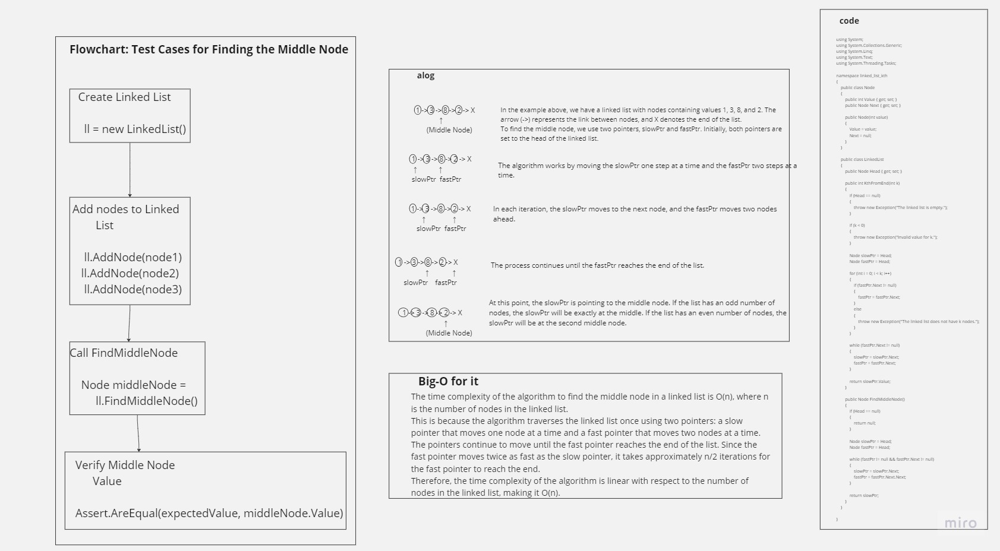

# linked-list-kth

--
`// Test Case: Finding the Middle Node
LinkedList ll = new LinkedList();
ll.AddNode(new Node(1));
ll.AddNode(new Node(3));
ll.AddNode(new Node(8));
ll.AddNode(new Node(2));`

`// Test: Verify the middle node value
Node middleNode = ll.FindMiddleNode();
int actualOutput = middleNode.Value;
int expectedOutput = 8;`

 `//Assertion: Compare actual output with expected output
Assert.AreEqual(expectedOutput, actualOutput, "Middle node value is incorrect.");`

**Test Case: Finding the Middle Node**

1. **What are you testing?**
   - We are testing the `FindMiddleNode` method of the `LinkedList` class.

2. **What should it do?**
   - It should return the value of the middle node in the linked list.

3. **What is the actual output?**
   - The actual output is the value of the middle node (`actualOutput` variable).

4. **What is the expected output?**
   - The expected output is the value we expect the middle node to have (`expectedOutput` variable).

**Assertion:**
- We assert that the actual output is equal to the expected output using the `Assert.AreEqual` method: `Assert.AreEqual(expectedOutput, actualOutput, "Middle node value is incorrect.")`.
- If the actual output and expected output are not equal, it indicates that the middle node value is incorrect.

**"Shoulds" of Unit Testing - Test Case: Finding the Middle Node**

1. **What are you testing?**
   - You are testing the `FindMiddleNode` method of the `LinkedList` class.

2. **What should it do?**
   - It should return the value of the middle node in the linked list.

3. **What is the actual output?**
   - The actual output is the value of the middle node (`actualOutput` variable) obtained by calling the `FindMiddleNode` method.

4. **What is the expected output?**
   - The expected output is the value we expect the middle node to have (`expectedOutput` variable).

5. **Assertion:**
   - The assertion statement `Assert.AreEqual(expectedOutput, actualOutput, "Middle node value is incorrect.")` checks if the actual output is equal to the expected output.
   - If the actual output and expected output are not equal, it indicates that the middle node value is incorrect.

By answering these questions and performing the assertion, we can ensure that the `FindMiddleNode` method behaves correctly and returns the expected value for the middle node in the linked list.
